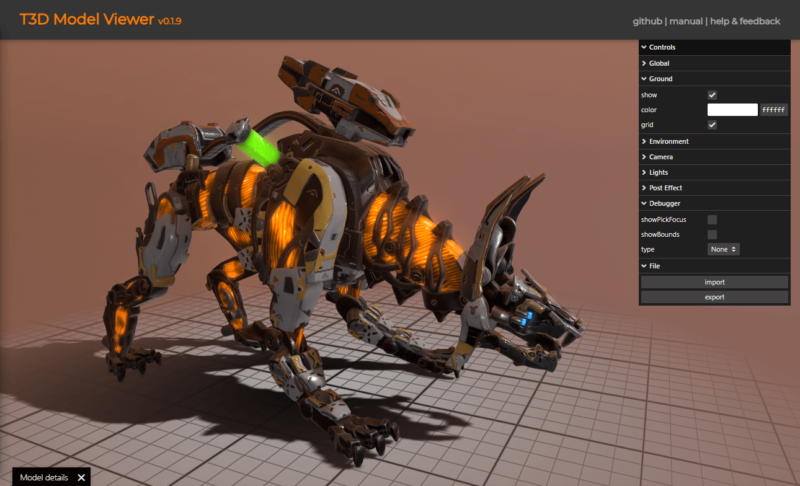
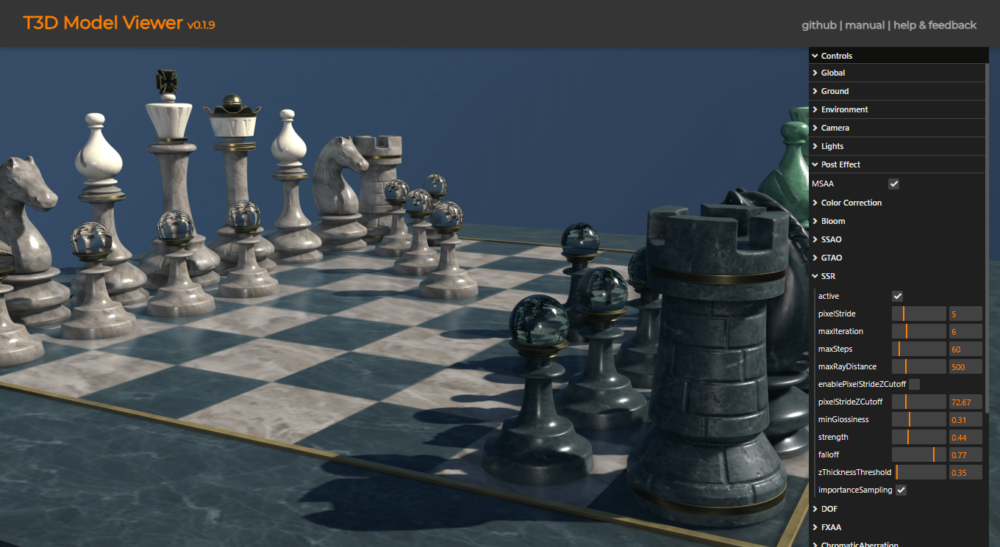

t3d-model-viewer
====

A [Model Viewer](https://uinosoft.github.io/t3d-model-viewer/) based on [t3d.js](https://github.com/UINOSOFT/t3d.js) and [t3d-effect-composer](https://github.com/UINOSOFT/t3d-effect-composer).

